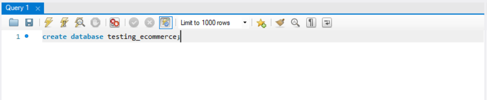
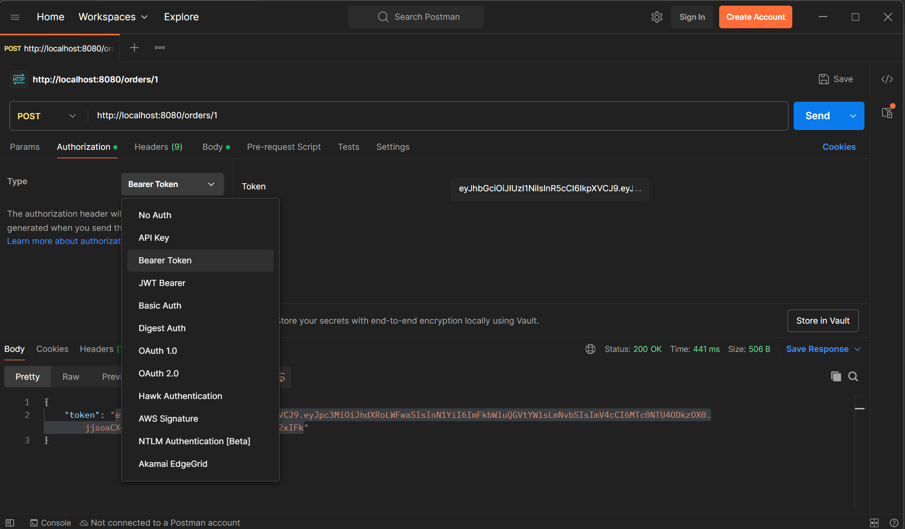
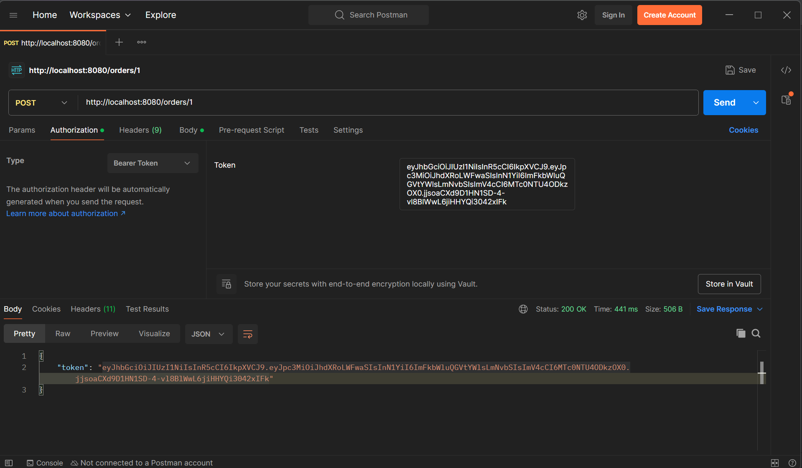

 # e-Commerce and Stock Control API
 
___

The main goal in this project is to train myself into creating an API that manages 
databases within users and admin interactions to products.

The administrators or the owners of commerce:

   - Able to Add, Remove and Update products from the Stock.

The users or clients:

   - Able to register, login, create orders, add products to an order, remove products of an order and cancel orders

___

## Future Upgrades and Improvements

- [x] Integrate Messages and Notifications; (on the way)
- [ ] Upload the application to a Container;
- [ ] View and Control Application Statistics;
- [ ] Monitor Application Health;
- [x] Add Custom Exception Handling;
- [ ] Add Payment Checkout structure;
- [x] Unit Testing Structures;
- [ ] Connection to another API (microservices training);
- [x] Scan with SonarQube;
- [x] Corrected SonarQube Issues;
- [ ] ...
___

## Getting Started

    First of all this is not a full developed app yet,
    so is still being updated and tests are done using 
    third parties applications (eg. Postman).

### Before Using 
You should have previously installed MySQL and a preference API that lets you interact with the CRUD commands (such as Postman).
 ___

 - #### Pull Down The Code
 - #### Make sure to Config your Database
  
  #### The DATABASE used in this code is MySQL
Make sure to create it using the following commands in MySQL Workbench.

 - ### Creating the DataBase in MySQL
On MySQL workbench, type the following command:
````
create database testing_ecommerce;
````
Then select the execute statement in the keyboard the Lightning with bar.


#### Now make sure to set up the application url in the application.properties file on your IDE.
It's located in the folder:

````plaintext
 ---src.
 |     |__ main
 |           |__ resourcers
 |               |__ application.properties
 |
 ---target
````

The application is set up to run in this database:
 ```shell
    spring.datasource.url=jdbc:mysql://localhost:3306/testing_ecommerce"
````
 - Make sure to check your Username and Password in the application.properties file
```shell
    spring.datasource.username= "YourUsername"
    spring.datasource.password= "YourPassword"
```  

Once is all setup is ready to be launched, just open your favorite IDE and starts the API. Note that the resources and application.properties does not exist in this project, you'll have to create it on your own, for that there is an example file to make things easier.

````plaintext
 ---src.
 |     |__ applications.properties.example.txt
 |
 ---target
````
Use it to create your own file and update it with your login information.
___

## Usage

```
    To First use it you have to create an account
  in the API database, HIGHLY recommended creating it
  as an ADMIN account.
```
Then remember this runs in localhost so the command will be using the following address as main:
````
   http://localhost:8080/
````
   ## Creating an ADMIN Account
   - Can be done by two ways:

As the application at the moment does not block the creation of administrator accounts you can simply create one choosing the ADMIN properties like the steps below.
 
- ### Register 
  ENDPOINT:
```shell 
    POST
    auth/register
```
   JSON Input Body for USER creation:

````
{
"name":"yourname",
"lastName":"yourlastname",
"email":"youremail",
"password":"yourpassword"
}
````
JSON Input Body for ADMIN creation:

````
{
"name":"yourname",
"lastName":"yourlastname",
"email":"youremail",
"password":"yourpassword",
"category":"0"
}
````
> Just change to your information to creat an account.

Send it and wait for the "Response 200 OK".

Now we can Log in the application.

- ### Login
  ENDPOINT:
```shell 
    POST
    auth/login
```
JSON Input Body for Login:

````
{
"email":"youremail",
"password":"yourpassword"
}
````
Send it and wait for the "Response 200 OK".

After that you will receive your *ACESS TOKEN*, copy and paste it in the authorization tab of your app for continue interacting with the other commands
>The token is a BEARER TOKEN, so make sure to select the right option in the menu.


> Then paste it correctly in the token area.


And now you are logged in as long as you keep the token while interacting with the app. It has an expiration time of 2 hours by default.
___

Now the commands that will follow are interactions with the application and the database.

There are 2 ways to access the commands:

- By USER Commands;
- By ADMIN Commands.

ADMIN have both USERs and ADMINs commands unlocked to use.

### User Command Guide

- ### Checking the Items in Stock
  ENDPOINT:
```shell 
    GET
    item
```

- ### Checking for specific Item in Stock
  ENDPOINT:
```shell 
    GET
    item/{item_id}
````
> Where the Item ID can be seen in the previous command and must be an integer.
> 
> Eg: "http://localhost:8080/items/1"
> 
> It retrieves the information of the item with ID 1


- ### Creating Orders
  ENDPOINT:
```shell 
    POST
    /orders/user/{user_id}
````
JSON Input Body for Order creation:

````
[
{
"itemName": "Potato",
"price":"0.99",
"quantity":"10"
}
] 
````
And you should receive a message of Order Created.

- ### Viewing Orders
  #### View All
  ENDPOINT:
```shell 
    GET
    orders/user/{user_id}
````

#### View Single Order
ENDPOINT:
```shell 
    GET
    orders/user/{user_id}/cart/{cart_id}
````

- ### Updating Orders
  #### Adding Items
  ENDPOINT:
```shell 
    PUT
    orders/add/user/{user_id}/cart/{cart_id}
````
JSON Input Body for Adding Items:

````
{
"items":
[
{
"itemName": "Potato",
"price":"0.99",
"quantity":"5"
}
]   
}
````

#### Removing Items
ENDPOINT:
```shell 
    PUT
    orders/remove/user/{user_id}/cart/{cart_id}
````
JSON Input Body for Removing Item:

````
{

}
````
> It removes 1 of the specified item at time.

- ### Cancelling Orders
ENDPOINT:
```shell 
    PUT
    orders/cancel/user/{user_id}/kart/{kart_id}
````
JSON Input Body for Removing Item from Kart:

````
{
"status":"cancel"
}
````
A cancelled order cannot be updated anymore. But it will still exist in the database for statistic purposes only.
___

### Admin Command Guide

- ### Adding new Items to Stock
  ENDPOINT:
```shell 
    POST
    item
```

JSON Input Body for Adding new Item to Stock:

````
{
  "price": 0.99,
  "itemName": "Potato",
  "quantity": 50
}
````

- ### Updating Items from Stock
  ENDPOINT:
```shell 
    PUT
    item/{item_id}
```

JSON Input Body for Updating Item from Stock:

````
{
  "price": 2.99,
  "itemName": "Potato",
  "quantity": 100
}
````

It's the same as putting a new item, but the values are changeable.

- ### Removing Items from Stock
  ENDPOINT:
```shell 
    DELETE
    item/{item_id}
```
Removes the item with the specified id from the storage and from the database.